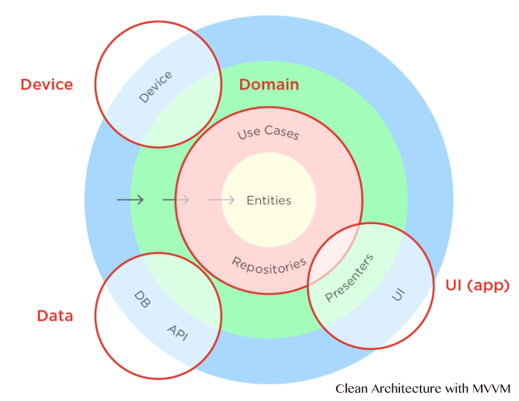
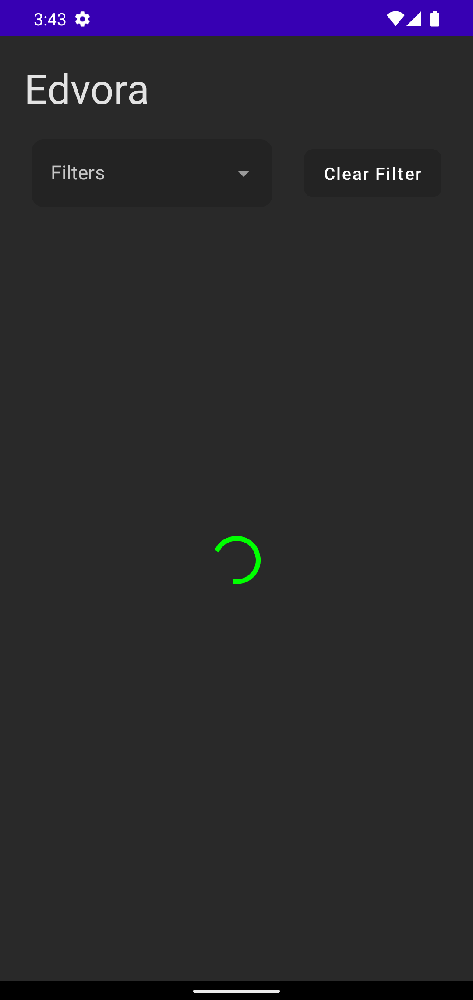
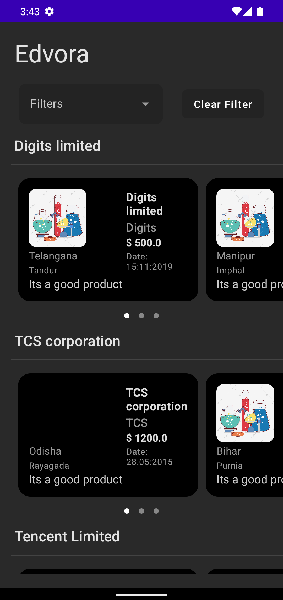
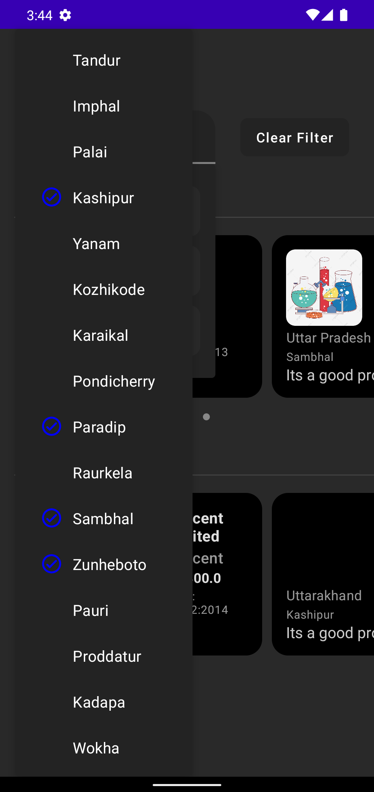
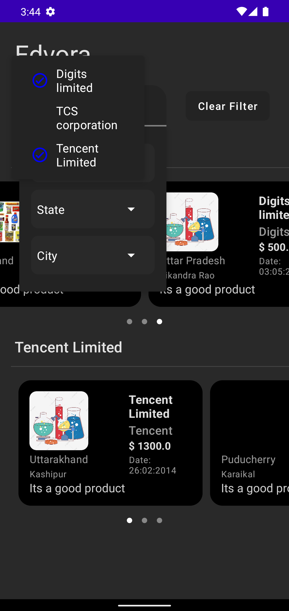
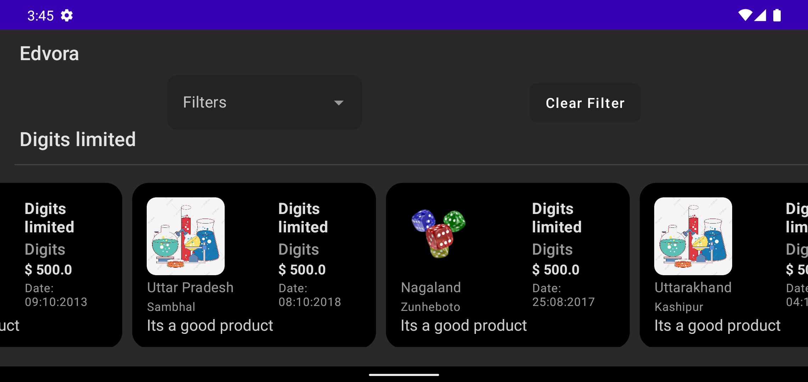

# Edvora

My adroid programming techniques using kotlin. Test at Edvora

## Libraries

Libraries used in the whole application are:

- [Jetpack](https://developer.android.com/jetpack)🚀
  - [Viewmodel](https://developer.android.com/topic/libraries/architecture/viewmodel) - Manage UI related data in a lifecycle conscious way
  - [Data Binding](https://developer.android.com/topic/libraries/data-binding) - support library that allows binding of UI components in  layouts to data sources, binds search results to UI
- [Retrofit](https://square.github.io/retrofit/) - Type-safe HTTP client and supports coroutines out of the box.  Used for the network calls.
- [Gson](https://github.com/google/gson) - Used to convert JSON to Java/Kotlin classes for the Retrofit
- [kotlinx.coroutines](https://github.com/Kotlin/kotlinx.coroutines) - Library Support for coroutines
-  [Hilt](https://developer.android.com/training/dependency-injection/hilt-android) - Used for Dependency injection
- [Glide](https://github.com/bumptech/glide) - Allows for fetching and displaying of images to imageviews

## Architecture

The app is built using the Modular MVVM architectural pattern and makes heavy use of a couple of Android Jetpack components. MVVM allows for the separation of concern which also makes testing easier. The app has a fragment that communicates to ViewModel which in turn communicates to the usecase which communiacates to Repository to get data.

||
|:----:|

## Screenshots

|||
|:----:|:----:|

|||
|:----:|:----:|

|
|:----:|
## Acknowledgements

- [Clean Architecture](https://blog.cleancoder.com/uncle-bob/2012/08/13/the-clean-architecture.html)

